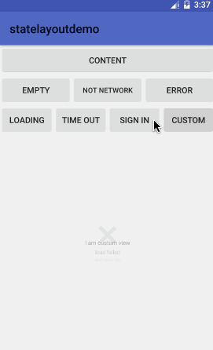

# StateLayout usage

## Demo




## Dependently
- one step
  add to your project `build.gradle`

``` basic
allprojects {
	repositories {
		maven { url 'https://jitpack.io' }
	}
}
```
- second step

``` basic
compile 'com.github.fingdo:stateLayout:1.0.4'
```

[中文文档点这里](README-zh.md)

### add in your xml

Usage is consistent with `ScrollView`, allowing only one root layout

``` xml
<com.fingdo.statelayout.StateLayout
        android:id="@+id/state_layout"
        android:layout_width="match_parent"
        android:layout_height="match_parent">
        <!-- 内容布局 one root view -->
</com.fingdo.statelayout.StateLayout>
```

### Styleable parameter
``` xml
<declare-styleable name="StateLayout">
    <!-- error tip image -->
    <attr name="errorImg" format="reference" />
    <!-- error tip text -->
    <attr name="errorText" format="string" />
    <!-- empty tip image -->
    <attr name="emptyImg" format="reference" />
    <!-- empty tip text -->
    <attr name="emptyText" format="string" />
    <!-- no network tip image -->
    <attr name="noNetworkImg" format="reference" />
    <!-- no network tip text -->
    <attr name="noNetworkText" format="string" />
    <!-- timeout tip image -->
    <attr name="timeOutImg" format="reference" />
    <!-- timeout tip text -->
    <attr name="timeOutText" format="string" />
    <!-- sign in tip image -->
    <attr name="loginImg" format="reference" />
    <!-- sign in tip text -->
    <attr name="loginText" format="string" />
    <!-- loading tip text -->
    <attr name="loadingText" format="string" />
</declare-styleable>
```

#### sample：

``` xml
<com.fingdo.statelayout.StateLayout
    xmlns:sl="http://schemas.android.com/apk/res-auto"
    android:id="@+id/state_layout"
    android:layout_width="match_parent"
    android:layout_height="match_parent"
    sl:emptyImg="@drawable/ic_state_empty"
    sl:emptyText="Empty"
    sl:errorImg="@drawable/ic_state_error"
    sl:errorText="Error"
    sl:loadingText="Loading..."
    sl:loginImg="@drawable/ic_state_login"
    sl:loginText="Sign in"
    sl:noNetworkImg="@drawable/ic_state_no_network"
    sl:noNetworkText="No Network"
    sl:timeOutImg="@drawable/ic_state_time_out"
    sl:timeOutText="Timeout">
</com.fingdo.statelayout.StateLayout>
```

### Code set icon and text (show before)
#### if you set `null`,will use last time tip text.set "" can show,only show tip image.
``` java
//StateLayout Constants Type
public static final int ERROR = 1;
public static final int EMPTY = 2;
public static final int TIMEOUT = 3;
public static final int NOT_NETWORK = 4;
public static final int LOADING = 5;
public static final int LOGIN = 6;
```


### Code show layout view
``` java
//show no network view
stateLayout.showNoNetworkView();
//show timeout view
stateLayout.showTimeoutView();
//show empty view
stateLayout.showEmptyView();
//show error view
stateLayout.showErrorView();
//show sign in view
stateLayout.showLoginView();

// such as the below pic
1，show
2，show when set string Id and image Id
3，show when set string Id
4，show when set string
5，show when set string and image Id
```

``` java
//show loading view
stateLayout.showLoadingView();

1，show
2，show when set string Id
3，show when set string
4，show when set custom view, example:
    1)progress bar
    2)gif imageView
    3)custom view
```

``` java
// show your custom view(not state view)
stateLayout.showCustomView();
```
show when set your custom view:


### Set switch animation
animation default is `false`，if you want to use animation

``` java
// use animation
stateLayout.setUseAnimation(true);
```
if you don't set custom animation，default is `FadeScaleViewAnimProvider` animation
if you want to set your custom animation

``` java
//set anmtion
stateLayout.setViewSwitchAnimProvider(new FadeScaleViewAnimProvider());
```
`stateLayout` have 2 animation now

``` java
// fade and scale animation
FadeScaleViewAnimProvider
// fade animation
FadeViewAnimProvider
```
if you want set custom your animation,please implements `ViewAnimProvider`

rewrite `showAnimation` and `hideAnimation` method。

``` java
//FadeViewAnimProvider.class
public class FadeViewAnimProvider implements ViewAnimProvider {

    @Override
    public Animation showAnimation() {
        Animation animation = new AlphaAnimation(0.0f,1.0f);
        animation.setDuration(200);
        animation.setInterpolator(new DecelerateInterpolator());
        return animation;
    }

    @Override
    public Animation hideAnimation() {
        Animation animation = new AlphaAnimation(1.0f,0.0f);
        animation.setDuration(200);
        animation.setInterpolator(new AccelerateDecelerateInterpolator());
        return animation;
    }

}
```


### Listen refresh and login click callback
please implements `StateLayout.OnViewRefreshListener`。

rewrite method：

``` java
//refresh layout
void refreshClick();
    
//login click
void loginClick();
```


Thanks [lufficc](https://github.com/lufficc/StateLayout) open source animation